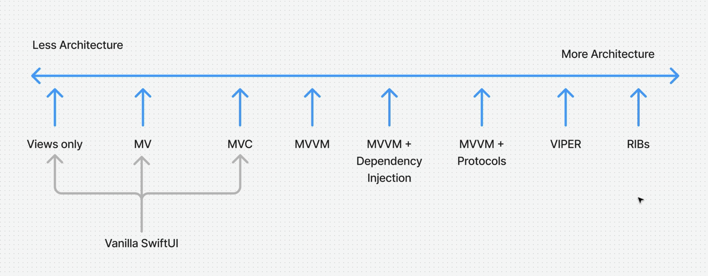
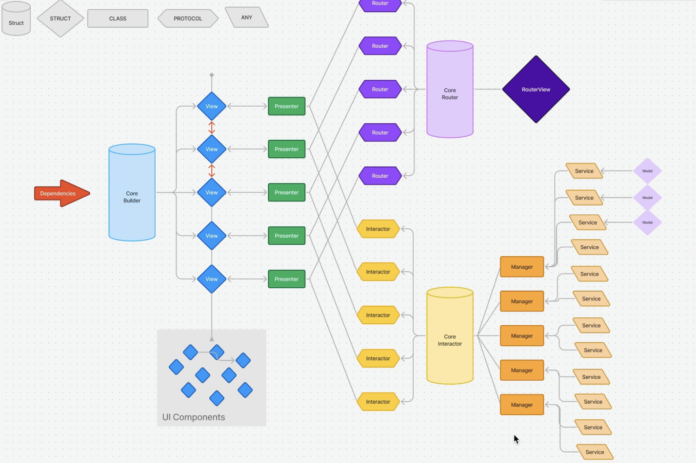

📱 SwiftUI Advanced Architecture

🗓 Duration: February 10, 2025 – April 11, 2025

🎓 Status: Completed

You can view the official course completion certificate below:

[📜 View Certificate](Assets/advancedArchitectureCert.pdf)

🧱 Course Overview

SwiftUI Advanced Architecture is a comprehensive course built by Nick Sarno (aka Swiftful Thinking) designed for experienced Swift developers aiming to build scalable, testable, and production-ready apps.

Over 150+ lessons, we built an AI-powered chat app with real-time messaging, in-app purchases, onboarding, local/remote data storage, and advanced SwiftUI architecture using MVC, MVVM, VIPER, and RIBs-like patterns.

Key highlights:
	•	Swift 6 + Swift Concurrency + Observation framework
	•	Modular codebase with dependency injection & protocol-oriented programming
	•	Built 4 reusable Swift Packages (Auth, Routing, Purchases, Logging)
	•	Integrated Firebase, StoreKit, RevenueCat, Mixpanel, and Xcode Cloud
	•	Wrote 100% testable code using unit/UI tests and SwiftUI mocking

